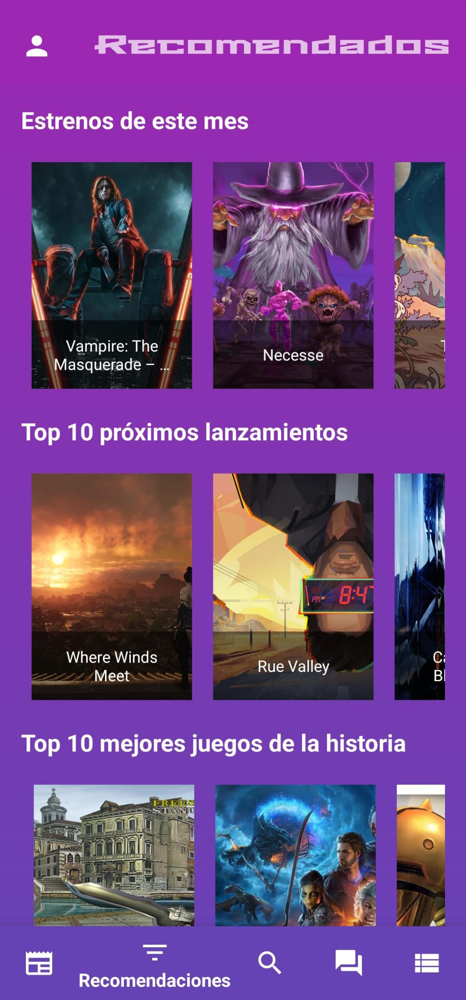

# 🎮 GameList

<div align="center">


**Una plataforma social para gestionar, descubrir y discutir sobre videojuegos**
<br>



<br/>

<br/>

[](https://github.com/AitorGC98/GameList/releases/tag/v1.0)

<br/>

[](https://www.android.com/)
[](https://kotlinlang.org/)
[](https://firebase.google.com/)
[](LICENSE)

[Características](#-características-principales) • [Tecnologías](#️-tecnologías) • [Instalación](#-instalación) • [Configuración](#-configuración-de-api-keys)

</div>

---

## 📖 Descripción

**GameList** es una aplicación móvil Android que funciona como una red social dedicada a los videojuegos. Inspirada en plataformas como MyAnimeList, permite a los usuarios gestionar sus colecciones de juegos, interactuar con una comunidad activa, mantenerse informados sobre las últimas noticias y descubrir nuevos títulos.

La aplicación combina funcionalidades de gestión personal con elementos sociales y de gamificación para crear una experiencia completa y motivadora.

Esta aplicación fue desarrollada como proyecto de final en mi formación academica.

---

## ✨ Características Principales

### 🗂️ Gestión de Listas
- **Organiza tus juegos** en categorías personalizadas:
  - 🎯 Jugando actualmente
  - ✅ Completados
  - 📅 Planeados para jugar
  - ❌ Abandonados
- Edita y actualiza tu progreso en cualquier momento

### 🔍 Descubrimiento
- **Recomendaciones personalizadas** basadas en:
  - Juegos más populares
  - Próximos lanzamientos
  - Top mejores lanzamientos del año
- **Búsqueda avanzada** con filtros por género, plataforma y más
- **Información detallada** de cada juego: desarrollador, fecha de lanzamiento, plataformas, etc.

### 💬 Comunidad y Foros
- **Crea y participa** en foros temáticos
- Sistema de **roles y moderación**:
  - Creadores de foros con privilegios de administrador
  - Control de baneos (15 min, 1 día, 1 semana, 1 mes, permanente)
  - Gestión de comentarios y respuestas anidadas
- **Chat en tiempo real** con actualización instantánea
- Vota y responde mensajes de otros usuarios

### ✍️ Reseñas
- Escribe y comparte tus opiniones sobre juegos
- Lee reseñas de otros usuarios
- Sistema de recomendaciones (recomendar/no recomendar)

### 📰 Noticias
- Mantente al día con las **últimas noticias** de la industria
- Integración con APIs especializadas en gaming

### 🎖️ Gamificación
- **Sistema de niveles y experiencia (XP)**
- Gana experiencia al:
  - Añadir juegos a tus listas
  - Publicar reseñas
  - Participar en foros
- Barra de progreso visible en el perfil

### 👤 Perfil Personalizable
- **Personaliza tu perfil** con:
  - Selección de avatares predefinidos
  - Nombre de usuario personalizado
  - Descripción personal
- **Estadísticas individuales**:
  - Cantidad de juegos por lista
  - Géneros más jugados
  - Foros activos
- **Tema claro/oscuro** configurable

### ⚙️ Configuración Flexible
- Habilita o deshabilita secciones de la app
- Personaliza tu página de inicio
- Información legal y de privacidad

---

## 🛠️ Tecnologías

### Desarrollo
- **Lenguaje**: Kotlin
- **IDE**: Android Studio (Koala+)
- **Min SDK**: API 24 (Android 7.0 Nougat)
- **Arquitectura**: MVVM con Navigation Component

### Backend y Servicios
- **Firebase Authentication**: Gestión de usuarios (Email/Password, Google Sign-In)
- **Firebase Firestore**: Base de datos NoSQL en tiempo real
- **Firebase Crashlytics**: Monitoreo de errores

### APIs Externas
- **RAWG API**: Base de datos de videojuegos
- **APINews**: Noticias de la industria del gaming

### Librerías Principales
- **Retrofit + Gson**: Consumo de APIs REST
- **Coroutines**: Programación asíncrona
- **Lottie**: Animaciones
- **Material Design 3**: Componentes de UI modernos
- **ViewPager2**: Navegación por pestañas
- **RecyclerView**: Listas optimizadas

---

## 📱 Instalación

### Requisitos Previos
- Android Studio Koala o superior
- Dispositivo Android con versión 7.0 (API 24) o superior
- Conexión a Internet
- **API Keys** de RAWG y APINews (ver sección de configuración)

### Pasos de Instalación

1. **Clona el repositorio**
```bash
git clone https://github.com/tu-usuario/gamelist.git
cd gamelist
```

2. **Abre el proyecto en Android Studio**
```bash
# Abre Android Studio y selecciona "Open an existing project"
# Navega hasta la carpeta del proyecto clonado
```

3. **Configura el archivo strings.xml** ⚠️
   
   El archivo `strings.xml` no está incluido en el repositorio por razones de seguridad. Debes crearlo manualmente:

   - Navega a: `app/src/main/res/values/`
   - Crea un archivo llamado `strings.xml`
   - **Ve a la sección [Configuración de API Keys](#-configuración-de-api-keys)** para obtener la estructura completa del archivo

4. **Sincroniza las dependencias**
   - Android Studio sincronizará automáticamente las dependencias
   - Espera a que finalice el proceso de Gradle Sync

5. **Compila y ejecuta**
   - Conecta tu dispositivo Android o inicia un emulador
   - Haz clic en "Run" o presiona `Shift + F10`

### Instalación desde APK
```bash
# Genera el APK
./gradlew assembleDebug

# El APK se generará en:
# app/build/outputs/apk/debug/app-debug.apk
```

Transfiere el APK a tu dispositivo Android e instálalo.

---

## 🔑 Configuración de API Keys

### ⚠️ IMPORTANTE
Por razones de seguridad, el archivo `strings.xml` que contiene las API keys **NO** está incluido en este repositorio. Debes crear y configurar este archivo manualmente antes de ejecutar la aplicación.

### Obtener las API Keys

1. **RAWG API Key**
   - Regístrate en [RAWG.io](https://rawg.io/apidocs)
   - Ve a tu perfil y genera una API Key
   - Es **GRATIS** para uso personal

2. **APINews Key**
   - Regístrate en [NewsAPI.org](https://newsapi.org/) o el servicio de noticias que uses
   - Obtén tu API Key gratuita

3. **Firebase** (Opcional si ya está configurado)
   - El proyecto ya incluye la configuración de Firebase
   - Si necesitas usar tu propia instancia, descarga `google-services.json` de tu proyecto Firebase

### Crear el archivo strings.xml

Crea el archivo en la ruta: `app/src/main/res/values/strings.xml`

### ✅ Verificación

Después de crear el archivo:

1. Haz un **Gradle Sync** (File > Sync Project with Gradle Files)
2. Verifica que no haya errores de compilación
3. Ejecuta la aplicación
4. Si ves datos de juegos y noticias, ¡todo funciona correctamente! 🎉

### 🔒 Seguridad

**NUNCA** subas el archivo `strings.xml` con tus API keys a GitHub o repositorios públicos. El archivo está incluido en `.gitignore` para evitar esto.
Lo correcto sería no guardar las Keys en el archivo strings, pero como este fue un proyecto con un límite de plazo muy corto y no será publicado en ninguna parte se optó por dejarlo en este archivo.

## 🗺️ Roadmap

### ✅ Implementado
- [x] Sistema de autenticación completo
- [x] Gestión de listas de juegos
- [x] Foros con chat en tiempo real
- [x] Sistema de reseñas
- [x] Gamificación (niveles y XP)
- [x] Noticias de videojuegos
- [x] Temas claro/oscuro
- [x] Estadísticas individuales

### 🚧 Mejoras Futuras
- [ ] Sistema de logros y recompensas
- [ ] Notificaciones push
- [ ] Chat privado entre usuarios
- [ ] Integración con redes sociales
- [ ] Encuestas en foros
- [ ] Leaderboard global
- [ ] Recomendaciones con IA
- [ ] Streaming de juegos (Twitch/YouTube)
- [ ] Contenido multimedia en chats
- [ ] Migración a base de datos relacional

---

## 🏗️ Arquitectura del Proyecto
```
app/
├── data/              # Modelos de datos y repositorios
├── ui/                # Activities, Fragments y ViewModels
│   ├── auth/         # Pantallas de autenticación
│   ├── main/         # Pantalla principal y navegación
│   ├── games/        # Gestión de juegos y listas
│   ├── forums/       # Sistema de foros
│   ├── profile/      # Perfil y configuración
│   └── news/         # Noticias
├── utils/            # Utilidades y helpers
├── adapters/         # Adaptadores de RecyclerView
├── api/              # Servicios de APIs
└── res/
    └── values/
        └── strings.xml   # ⚠️ NO incluido (ver configuración)
```

---

## 🤝 Contribuciones

Las contribuciones son bienvenidas. Si deseas colaborar:

1. Haz un fork del proyecto
2. Crea una rama para tu feature (`git checkout -b feature/AmazingFeature`)
3. **NO incluyas** tu archivo `strings.xml` con API keys en los commits
4. Commit tus cambios (`git commit -m 'Add: AmazingFeature'`)
5. Push a la rama (`git push origin feature/AmazingFeature`)
6. Abre un Pull Request

---

## 📋 Planificación del Proyecto

**Duración total**: 1 meses y 2 semanas y 3 días

- **Fase 1** (1 semanas): Diseño UI/UX y autenticación
- **Fase 2** (1,5 semanas): Integración API RAWG
- **Fase 3** (1,5 semanas): Integración Firestore y foros
- **Fase 4** (3 días): Sistema de noticias
- **Fase 5** (1 semana): Configuración y personalización
- **Fase 6** (1 semana): Pruebas y optimización


## ❓ Solución de Problemas

### La app no compila
- ✅ Verifica que hayas creado el archivo `strings.xml`
- ✅ Asegúrate de que las API keys estén correctamente configuradas
- ✅ Haz un **Clean Project** y **Rebuild Project**

### No se cargan los juegos
- ✅ Verifica tu API key de RAWG
- ✅ Comprueba tu conexión a Internet
- ✅ Revisa que la URL base de RAWG sea correcta

### No aparecen noticias
- ✅ Verifica tu API key de News
- ✅ Asegúrate de tener conexión a Internet
- ✅ Algunas APIs de noticias tienen límites diarios en el plan gratuito

---

## 📄 Licencia

Este proyecto es parte del Trabajo de Fin de Grado del CFGS "Desarrollo de Aplicaciones Multiplataforma" (Curso 2024/2025).

---

## 👨‍💻 Autor

**Aitor García Curado**

CFGS Desarrollo de Aplicaciones Multiplataforma - Curso 2024/2025

---

## 📞 Soporte

Si encuentras algún problema o tienes sugerencias:

- Abre un [Issue](https://github.com/tu-usuario/gamelist/issues)
- Utiliza la sección de soporte dentro de la aplicación
- **Para problemas con API keys**: Revisa la [sección de configuración](#-configuración-de-api-keys)

---

<div align="center">

**Hecho con ❤️ y mucho ☕ por la comunidad gamer**

⭐ Si te gusta el proyecto, no olvides darle una estrella ⭐

</div>
